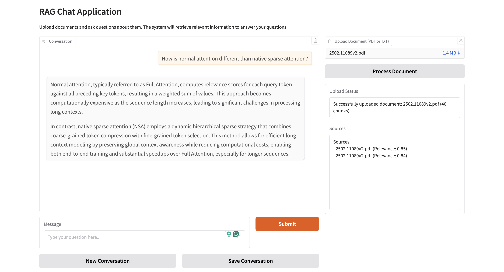

# RAG Chat Application

This project implements a Retrieval-Augmented Generation (RAG) system that integrates document processing, vector embeddings, and OpenAI's language models to provide context-aware responses to user queries.

## Application Screenshot



## Features

- **Document Processing**: Upload and process PDF and TXT files
- **Semantic Search**: Find relevant information using embeddings-based similarity
- **Conversation History**: Maintain context across multiple user interactions
- **Query Enhancement**: Improve search results with automatic query expansion
- **Multi-Source Retrieval**: Get information from diverse documents
- **Interactive Interface**: User-friendly Gradio web interface


## Setup Instructions

### Prerequisites

- OpenAI API Key

### Environment Setup

1. Clone the repository:
   ```
   git clone https://github.com/jigarthummar/rag-chat.git
   cd rag-chat
   ```

2. Create a virtual environment:
   ```
   python -m venv .venv
   ```

3. Activate the virtual environment:
   ```
   source .venv/bin/activate  # On Linux/Mac
   .venv\Scripts\activate     # On Windows
   ```

4. Install requirements:
   ```
   pip install -r requirements.txt
   ```

5. Set up your .env file with your OpenAI API key:
   ```
   OPENAI_API_KEY=your_api_key_here
   ```

### Running the Application

Start the Gradio web interface:
```
python gradio_app.py
```

The application will be available at `http://127.0.0.1:7860`
